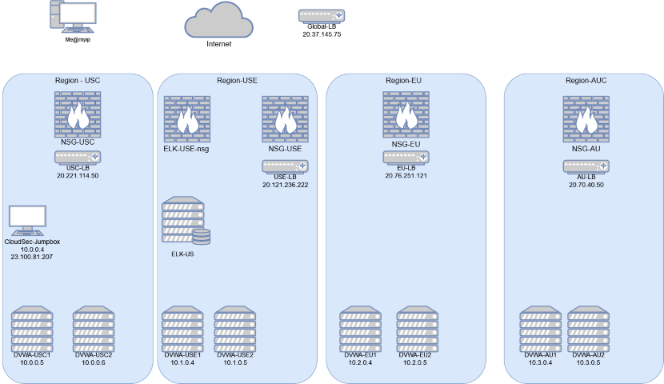

# Automated ELK Stack Deployment

-----

## Table of Contents

- [Introduction](readme.md#introduction)
- [Overview](readme.md#overview)
- [Topology](readme.md#topology)
- [Redundancy](readme.md#redundancy)
- [Access Policies](readme.md#access-policies)
- [ELK Configuration](readme.md#elk-configuration)
- [Target Machines & Beats](readme.md#target-machines--beats)
- [Using the Playbook](readme.md#using-the-playbook)
- [Scaling & Expansion](readme.md#scaling--expansion)

-----

### Introduction

This was originally a project that I completed during the University of Minnesota Cybersecurity Bootcamp that I completed. It initially only utilized 3 DVWA machines and 1 ELK server. When I looked back upon the work that I had done, I thought that it was good, but could be expanded. One thing that I wanted to add was more VM's running the DVWA container, and attempting to add machines in multiple regions for 'Global' redundancy.

### Overview

-----

-----

The network diagram above gives an overview of all of the resources created within Microsoft Azure. To achieve global redundancy I created four virtual networks across four seperate regions. Within each virtual network a load balancer splits the traffic between two DVWA machines. The four seperate virtual networks are peered within Azure to allow access between regions. A global load balancer will route your traffic to the closest (physical) region. A jumpbox was created in the US - Central(USC) region to both add an additional layer of security, and to allow each DVWA instance to be configured the exact same. This also allows for multiple new DVWA instances to be created simultaniously by simply editing the Ansible `hosts` file.

## Topology

-----

The first thing that I wanted to add into this project was creating instances across multiple regions. While having multiple instances of the DVWA container running in the same region offers redundancy if one instance fails and allows more traffic to access the application, it doesn't offer availability if one regions data center loses power, or goes offline. 

Each individual region has the following resources :
- Virtual Network
- Network Security Group
- Load Balancer
- 2 Virtual Machines hosting DVWA.

## Virtual Networks

-----

Each region that DVWA instances were created in required it's own virtual network. 
### Load Balancers

| Load Balancer Name | Public IP Address |
|--------------------|-------------------|
| Global-LB          |      20.37.145.75 |
| USC-LB             |     20.221.114.50 |
| USE-LB             |    20.121.236.222 |
| EU-LB              |     20.76.251.121 |
| AU-LB              |       20.70.40.50 |

Creating instances across four seperate regions allows access in Europe even if the entire United States loses power. Each region has it's own load balancer to split the traffic between the instances located in that region. 

### Redundancy

### Access Policies

### ELK Configuration

### Target Machines & Beats

### Using the Playbook

### Scaling & Expansion
